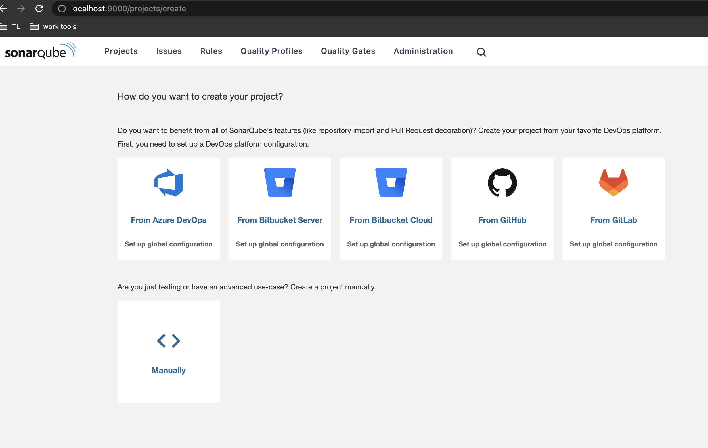
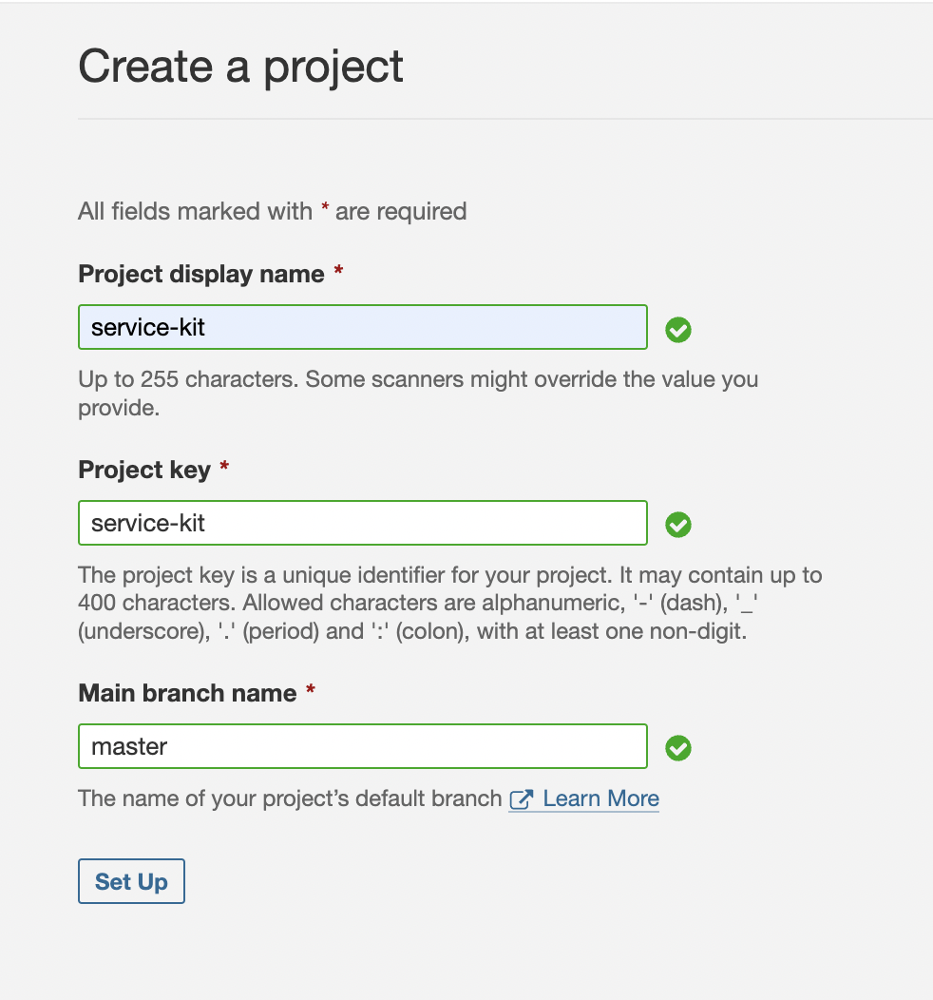
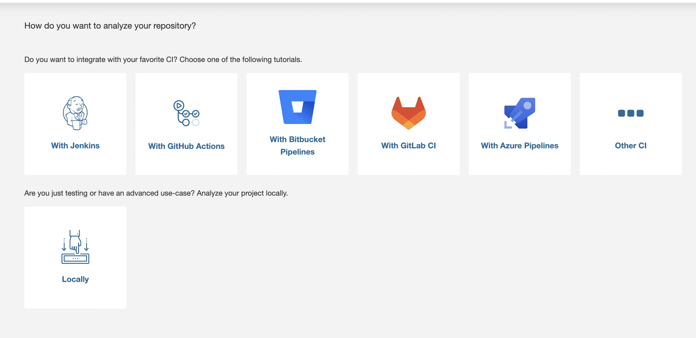
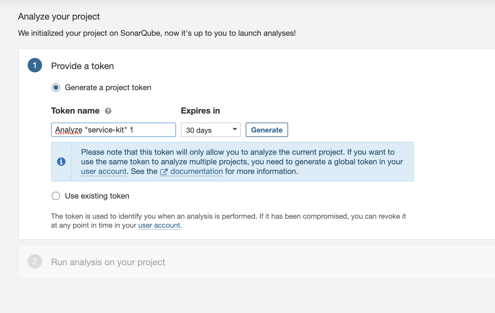
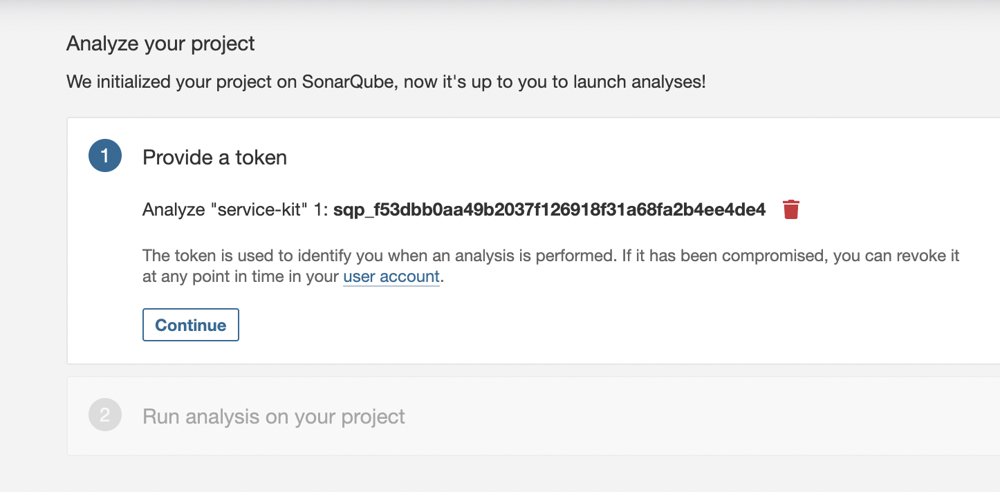
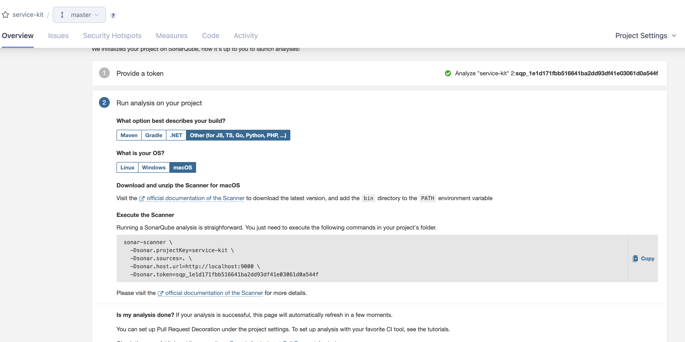

<div align="center">
  <a href="https://confluence.gamesys.co.uk/display/UP/The+Framework" title="Service Kit">
    
  </a>
  <br />
  <h1>Service Kit</h1>
</div>

<p align="center">
   Node.js Koa RESTful Backend-For-Frontend microservice library with Docker, Swagger, Typescript, Jest, Go CI, Jenkins and NexusIq.
</p>

<div align="center">
  <a href="https://gocd.psunicorncd.pgt.gaia/go/pipelines?viewName=gm2#!/">
    
  </a>
  <a href="/">
    
  </a>
  
  
</div>

<br />

**Service Kit** is a Reusable micro-service tools with everything you need to spin up and configure a micro-service.
This include the following:

- Logging to STDOUT/STDERR stream using [Winston](https://github.com/winstonjs/winston/)
- Config management like env variables, is managed by [convict](https://github.com/mozilla/node-convict/tree/master/packages/convict)
- A super small and optimized [Docker](https://www.docker.com/) image based on [Docker files](./docs/docker.md).
- [Swagger](https://swagger.io/) API documentation based on JSDoc
- Continuous integration and delivery using [GoCI](https://www.gocd.org/)
- Unit Test and Integration Test along with Test Coverage using [Jest](https://facebook.github.io/jest/) testing framework

---

## Table of contents

- [General info](#service-kit)
- [Technologies](#technologies)
- [Packages/Tools](#packages)
- [Load Testing](#Load-Testing)
- [Sonarqube Local Setup](#sonarqube-local-setup)
- [Setup](#setup)
  - [Configuration](#Configuration)
  - [Local](#local)
  - [Docker](#docker)
  - [Test](#test)
- [Rules](#rules)
  - [hooks](#hooks)
- [Service Create-Deploy Steps](#service-create-deploy-steps)
- [Docs Links](#docs-links)

---

## Technologies

- [Typescript](https://www.typescriptlang.org/)
- [Koa](https://koajs.com/)
- [Jest](https://jestjs.io/)
- [Jenkins](https://www.jenkins.io/)
- [GoCD/CI](https://gocd.psunicorncd.pgt.gaia/go/pipelines?viewName=gm2#!/)
- [NexusIq](https://nexusiq.gamesysgames.com/assets/index.html#/dashboard/applications)
- [Kubernetes](https://kubernetes.io/)
- [Docker](https://www.docker.com/)
- [Dynatrace](https://www.dynatrace.com/)
- [Splunk](https://www.splunk.com/)
- [K6 load testing](https://k6.io/)

---

## Packages

- [Service-Kit-Generator](./packages/service-kit-generator/README.md)
- [Service-Kit-Config-Loader](./packages/service-kit-config-loader/README.md)
- [Service-Kit-Logger](./packages/service-kit-logger/README.md)
- [Service-Kit-Common](./packages/service-kit-common/README.md)
- [Service-Kit-Redis](./packages/service-kit-redis/README.md)
- [Service-Kit-Cacher](./packages/service-kit-cacher/README.md)
- [Service-Kit-Server](./packages/service-kit-server/README.md)
- [Service-Kit-Core](./packages/service-kit-core/README.md)

---

## Setup

```zsh
$ npm install yarn
```

### Configuration

Add a `.env` file to the root of the project to set Environment Variables, e.g.

```properties
PORT=5001
LOG_LEVEL=debug
```

### Local Development

```zsh
$ brew install redis

$ redis-server
```

```zsh
$ yarn
$ yarn start
```

### Test

All test for this boilerplate uses following tools.

- [Jest](https://github.com/facebook/jest)
- [supertest](https://github.com/visionmedia/supertest) - Easy HTTP assertions for integration test

```zsh
# Test
$ yarn test                           # Run only unit test
$ yarn test:integration               # Run only integration test
# Test (Watch Mode for development)
$ yarn test:watch                     # Run all test with watch mode
$ yarn lintify                        # Lint all sourcecode
$ test:load                           # Run endpoint load-test with k6
```

Load testing requires k6, install with homebrew:

```
`brew install k6`
```

---

## Sonarqube Local Setup

Steps to run sonarqube locally and test the app

1- Install and run sonarqube docker image

```zsh
$ yarn sonarqube:docker
```

2- Once it starts to run , check http://localhost:9000 and login as username: admin, pass: admin then change the password to anything you like
3- Once you login the sonarqube UI the follow the steps in images

- create a new project
  

- populate the fields as in example and click "set up"
  

- choose "Locally"
  

- generate token and copy it to paste in sonar-local.properties file
  

- click continue
  

- choose the options as in example
  

4- once the setup is done populate the sonar-local.properties file with correct details
5- Run the sonarqube scan and when the scan finishes it will auto-refresh the page with scan results

```zsh
 $ yarn sonarqube:start
```

6- When its done stop the sonarqube docker container

```zsh
 $ yarn sonarqube:stop
```

---

## Rules

**ᕦ⊙෴⊙ᕤ**

### Hooks

The repo is using [husky](https://github.com/typicode/husky) to run pre-commit and pre-push hooks.
Ths husky configuration can be found in `.huskyrc`

Linting is run on pre-commit and lints all .js/.ts and .yaml files in the repo.
Linting .yml uses [yamllint](https://yamllint.readthedocs.io/en/stable/) with the configuration for it being in `yamllint-cofig.yaml` which is modifying the relaxed ruleset for linting yaml.

Additional rules for formatting yaml files are enforced in the `.editorconfig` living in the repo root. this will be used by the editor when modifying yaml files.

Additionally to that, there's a **YAML Sort** VSCode plugin that has support for formatting, sorting and validating yaml which can be run manually over yaml files.

The plugin supports quite a few commands that can be run from the vscode command palette _(Cmd+Shift+P)_.

To reformat your yaml files according to the ruleset type in hte command palette:

```sh
  Format YAML
```

To validate a given yaml file:

```sh
  Validate YAML
```

---

## Service Create-Deploy Steps

**ᕦ⊙෴⊙ᕤ**
After generating a new app with service-kit-generator, there are some crucial steps to be followed for the walking skeleton delivery.

1.  Update the pipeline files in deployment folder based on the app name that will be used. Plus update the required env variables in deployment/config folder.
2.  New service should be asked to be in JIRA insights through emailing Release Managers [example](https://jira.gamesys.co.uk/secure/insight/assets/GSYS-2307).
3.  Create a support ticket for service DNS setup
    Support Hub -> Production Support -> I have a task for production environment [example](https://servicedesk.gamesys.co.uk/plugins/servlet/desk/portal/3/PS-5654).
    !!! Note that the ingress configs MUST BE mentioned for all required environements. so far EU , TROP, AZ ,NY .
    any new environments in future have to be added.
      <details>
        <summary>Example</summary>

          - INT03:
          —

          name: Create ingress
          k8s:
          state: present
          definition:
          apiVersion: extensions/v1beta1
          kind: Ingress
          metadata:
          name: localisation-keystore-ingress
          namespace: unicorn
          annotations:
          kubernetes.io/ingress.class: "nginx"
          ingress.kubernetes.io/rewrite-target: /
          spec:
          rules:
          host: localisation-keystore.int03.integration.pgt.gaia
          http:
          paths:
          path: /
          backend:
          serviceName: localisation-keystore-service
          servicePort: 80

          - INT08:
          —

          name: Create ingress
          k8s:
          state: present
          definition:
          apiVersion: extensions/v1beta1
          kind: Ingress
          metadata:
          name: localisation-keystore-ingress
          namespace: unicorn
          annotations:
          kubernetes.io/ingress.class: "nginx"
          ingress.kubernetes.io/rewrite-target: /
          spec:
          rules:
          host: localisation-keystore.int08.integration.pgt.gaia
          http:
          paths:
          path: /
          backend:
          serviceName: localisation-keystore-service
          servicePort: 80
          </details>

          - INT09:
          —

          name: Create ingress
          k8s:
          state: present
          definition:
          apiVersion: extensions/v1beta1
          kind: Ingress
          metadata:
          name: localisation-keystore-ingress
          namespace: unicorn
          annotations:
          kubernetes.io/ingress.class: "nginx"
          ingress.kubernetes.io/rewrite-target: /
          spec:
          rules:
          host: localisation-keystore.int09.integration.pgt.gaia
          http:
          paths:
          path: /
          backend:
          serviceName: localisation-keystore-service
          servicePort: 80

          - INT10:
          —

          name: Create ingress
          k8s:
          state: present
          definition:
          apiVersion: extensions/v1beta1
          kind: Ingress
          metadata:
          name: localisation-keystore-ingress
          namespace: unicorn
          annotations:
          kubernetes.io/ingress.class: "nginx"
          ingress.kubernetes.io/rewrite-target: /
          spec:
          rules:
          host: localisation-keystore.int10.integration.pgt.gaia
          http:
          paths:
          path: /
          backend:
          serviceName: localisation-keystore-service
          servicePort: 80

          - PPC1:
          —

          name: Create ingress
          k8s:
          state: present
          definition:
          apiVersion: extensions/v1beta1
          kind: Ingress
          metadata:
          name: localisation-keystore-ingress
          namespace: unicorn
          annotations:
          kubernetes.io/ingress.class: "nginx"
          ingress.kubernetes.io/rewrite-target: /
          spec:
          rules:
          host: localisation-keystore.stg.ppc1.pgt.gaia
          http:
          paths:
          path: /
          backend:
          serviceName: localisation-keystore-service
          servicePort: 80

          - PPC2:
          —

          name: Create ingress
          k8s:
          state: present
          definition:
          apiVersion: extensions/v1beta1
          kind: Ingress
          metadata:
          name: localisation-keystore-ingress
          namespace: unicorn
          annotations:
          kubernetes.io/ingress.class: "nginx"
          ingress.kubernetes.io/rewrite-target: /
          spec:
          rules:
          host: localisation-keystore.stg.ppc2.pgt.gaia
          http:
          paths:
          path: /
          backend:
          serviceName: localisation-keystore-service
          servicePort: 80

          - PP21:
          —

          name: Create ingress
          k8s:
          state: present
          definition:
          apiVersion: extensions/v1beta1
          kind: Ingress
          metadata:
          name: localisation-keystore-ingress
          namespace: unicorn
          annotations:
          kubernetes.io/ingress.class: "nginx"
          ingress.kubernetes.io/rewrite-target: /
          spec:
          rules:
          host: localisation-keystore.stg.pp21.pgt.gaia
          http:
          paths:
          path: /
          backend:
          serviceName: localisation-keystore-service
          servicePort: 80

          - PP22:
          —

          name: Create ingress
          k8s:
          state: present
          definition:
          apiVersion: extensions/v1beta1
          kind: Ingress
          metadata:
          name: localisation-keystore-ingress
          namespace: unicorn
          annotations:
          kubernetes.io/ingress.class: "nginx"
          ingress.kubernetes.io/rewrite-target: /
          spec:
          rules:
          host: localisation-keystore.stg.pp22.pgt.gaia
          http:
          paths:
          path: /
          backend:
          serviceName: localisation-keystore-service
          servicePort: 80

          - LIVE-EU:
          —

          name: Create ingress
          k8s:
          state: present
          definition:
          apiVersion: extensions/v1beta1
          kind: Ingress
          metadata:
          name: localisation-keystore-ingress
          namespace: unicorn
          annotations:
          kubernetes.io/ingress.class: "nginx"
          ingress.kubernetes.io/rewrite-target: /
          spec:
          rules:
          host: localisation-keystore.prod.l1.inx.gaia
          http:
          paths:
          path: /
          backend:
          serviceName: "localisation-keystore-service"
          servicePort: 80

          - LIVE-TROP:
          —

          name: Create ingress
          k8s:
          state: present
          definition:
          apiVersion: extensions/v1beta1
          kind: Ingress
          metadata:
          name: localisation-keystore-ingress
          namespace: unicorn
          annotations:
          kubernetes.io/ingress.class: "nginx"
          ingress.kubernetes.io/rewrite-target: /
          spec:
          rules:
          host: localisation-keystore-service.prod.l1.trop.gaia
          http:
          paths:
          path: /
          backend:
          serviceName: "localisation-keystore-service"
          servicePort: 80

          - LIVE-AZ:
          —

          name: Create ingress
          k8s:
          state: present
          definition:
          apiVersion: extensions/v1beta1
          kind: Ingress
          metadata:
          name: localisation-keystore-ingress
          namespace: unicorn
          annotations:
          kubernetes.io/ingress.class: "nginx"
          ingress.kubernetes.io/rewrite-target: /
          spec:
          rules:
          host: localisation-keystore-service.prod.l1.usaz1.gaia
          http:
          paths:
          path: /
          backend:
          serviceName: "localisation-keystore-service"
          servicePort: 80

          - LIVE-NY:
          —

          name: Create ingress
          k8s:
          state: present
          definition:
          apiVersion: extensions/v1beta1
          kind: Ingress
          metadata:
          name: localisation-keystore-ingress
          namespace: unicorn
          annotations:
          kubernetes.io/ingress.class: "nginx"
          ingress.kubernetes.io/rewrite-target: /
          spec:
          rules:
          host: localisation-keystore.prod.l1.usny1.gaia
          http:
          paths:
          path: /
          backend:
          serviceName: "localisation-keystore-service"
          servicePort: 80

    </details>

4.  Once the support ticket is resolved by NOC team, On Unicorn tower bootstrap creating a new pr with new service config. https://github.gamesys.co.uk/PlayerServices/unicorn-tower-bootstrap/tree/master/roles.

5.  Once the unicorn-tower-bootstrap PR is merged , for all environments
    <details>
        <summary>Control Centre Steps</summary>

        ## Int Control Centre - https://controlcentre.int90.integration.pgt.gaia/

        1. project ->Player Services - Unicorn - Provisioning Project

        2. templates -> Unicorn - Provisioning Job Template trigger

        ## PP Control Centre - https://controlcentre.stg.pgt.gamesysgames.com

        1. project ->Player Services - Unicorn - Provisioning Project

        2. templates -> Unicorn - Provisioning Job Template trigger

        ## LIVE environments

        1. ASK noc to trigger provisioning to generate templates for all specific environments (EU,TROP,AZ,NY etc).

    </details>

6.  Once Control Centre is done,

- Check templates to get their IDs
- Update IDs in app/deployment pipeline templates

7. unicorn-artm should be updated with new service if needed. [artm change example](https://github.gamesys.co.uk/client-delivery-platform/unicorn/pull/3749/files)
   [First release ticket for a new service](https://github.gamesys.co.uk/client-delivery-platform/unicorn/tree/dev/packages/unicorn-artm#first-release-ticket-for-a-new-app)

8. When all steps above are done gocd pipelines should be created .

- GoCD -> admin -> Config Repositories create new service like others same settings

9. Create Repo on github and create [Jenkins-pipeline](./packages/service-kit-generator/README.md) Jenkins Pipeline

10. Add the app in SonarQube.(contact with Tech Leads)

- to add [sonarqube integration](https://confluence.gamesys.co.uk/display/TechnicalArchitect/Sonar+Pull+Request+Decoration+in+Github?searchId=BC7TPGXPX) in github repo. Add the new service in [app list](https://github.gamesys.co.uk/github-apps/sonarqube-enterprise-pr-checks/installations/89).

11. Set the application repo settings as others.(branch, collabolators, hooks etc)

12. As a last step , app PR can be raised and merged.

- After merge,if any problem occurs in gocd pipelines related to artm [version dashboard](https://versions.pgt01.gamesysgames.com/#/)
  check [artm readme](https://github.gamesys.co.uk/client-delivery-platform/unicorn/tree/dev/packages/unicorn-artm#support-new-live-env) or reach out to Rhino Team.

13. For the consumer side service should be added/defined in nginx config. [nginx change example](https://github.gamesys.co.uk/client-delivery-platform/unicorn-nginx-config/pull/1065)

---

## Docs Links

- [The Library ADR 1](https://confluence.gamesys.co.uk/display/UP/The+Library)
- [The Library INFO](https://confluence.gamesys.co.uk/display/UP/The+Framework)
- [Load Testing Setup](/docs/loadTestingStrategyAdr.md)
- [Load Testing Strategies](https://confluence.gamesys.co.uk/pages/viewpage.action?spaceKey=UP&title=%5BSpike%5D+GTECH-70901+-+Performance+and+load+testing+strategy)
