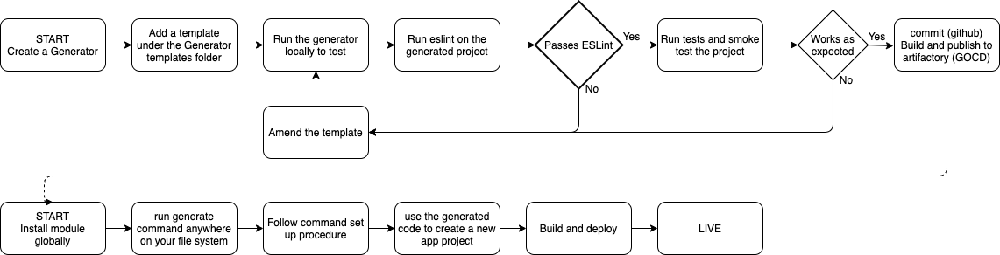

# @service-kit/generator

## Introduction

This package is a microservice project generator based on [plop.js](https://plopjs.com/), and comprises of a microservice template accompanied with command-line actions defined in a `plopfile.js` and defines the user interactions needed to generate a new microservice.

## Features

* Generates a new microservice anywhere in your file system (through `npx`) or when developing the template (with `npm link`)
* Uses [Handlebars](https://handlebarsjs.com) under the hood, please check out the Docs for an in-depth guide to its usage.
---
## Getting started

### Generating a Microservice project

Once @Service-kit scoped modules (the generator) is published to Artifactory or NPM, you can execute the following command anywhere in your file system using npx to ensure the latest generator is used.

```sh
# The preferred method
npx @service-kit/generator
```

Alternatively, you can globally install the @service-kit/generator, **though not advised**, you can:

```sh
npm install -g  @service-kit/generator

# You can then execute anywhere in your file system, where you wish your project to be created.
generate
```

### Developing the Microservice template
begin by cloning the service-kit monorepo and navigate to the root of the service-kit-generator:

```sh
cd service-kit/packages/service-kit-generator

npm link
```
This should create a symbolic link to the global npm node_modules, to test your changes, just execute the following somewhere in your directory structure:
```sh
generate
```
> NOTE 1: remove any previously linked or globally installed version prior to the above so to avoid conflicts.

---
## Usage

### Creating new services
In normal use, you would just use the `npx` command to generate a new microservice, you will be prompted with the following commands:

- What is your new service name? (default: service-a)
- What is your new service name for the group (Ansible deployment scripts)? (default: New_Microservice)
- What is your service id? (default: service-id-1)
- What is your service version? (default 1.0.0)
- What will the port be for your new service? (default: 3000)

### Developing the template
When making changes to the template, the following steps need to be considered:
- Make sure `npm link` is applied for from within the `service-kit-generator`
- For testing the generated output, choose a directory outside the monorepo to ensure that it's running in isolation
- By default, plop will prevent accidental overwriting of the generated file, especially in cases where your in the middle of developing it, and the `generate` command is executed again with the same file name and location of the generated file. However it is sometimes necessary to repeatedly overwrite the file to make the dev experience easier by adding `force: true` to the `actions array` in the `plopfile` to force file overwriting. Note that this should only be done when developing the template.
- with `force: true` in place, execute `generate` each time you make changes to the template or the plopfile and check your changes within the generated project, NOT the template, in the following manner:
    1. Run eslint on the generated project to ensure linting rules are applied.
    1. Run tests on the generated project.
    1. Smoke test the project in terms of
        - yarn and yarn build, see note 2
        - Spinning up a service locally
        - Spinning up a service through docker
    1. Any failures detected, repeat steps beginning at 1

> Note 2: its a good idea to clean up your node modules or better still delete the generated project to ensure that it still works on initial creation of the project.

Generator Workflows

## Jenkins Pipeline
### Connecting Jenkins to the new generated service
After new service is generated it will pick up all the necessary files and will spit out everything plus the .Once the new service template is ready with default jenkins setup .
- make sure template generated with jenkinsfile.
- connect the jenkins pipeline by using the [Jenkings UI](https://jenkins.psunicorn.pgt.gaia/blue/organizations/jenkins/pipelines).
- on the UI clicking 'add new pipeline' for the service.
- Github Enterprise -> Github Gamesys -> Player Services -> Repo Name -> update setting as other services [example](https://jenkins.psunicorn.pgt.gaia/job/content-aggregation-service/configure)

## Common issues
### Unintended template parsing
In situations where your template files are composed of mixed languages, there may be a situation where some files are picked up by handlebars that inherently use the same notation using double curly brace notation, for example, Ansible templates.
If Handlebars encounters these, it will either substitute it if a match is found defined in one of the plopfile command actions, or it will delete it completely if a match is not found. To prevent this, you should use the escape backslash `\` before the expression like so `\{{my_variable}}` to preserve them in the generated template.
