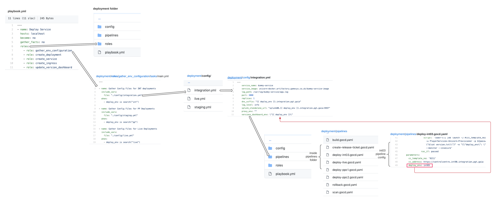
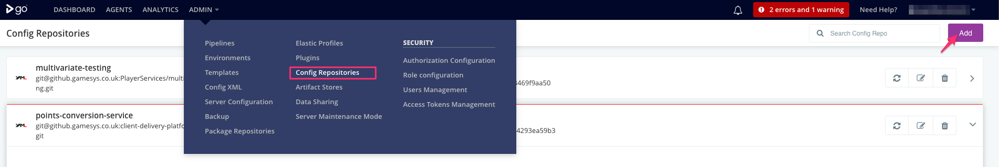
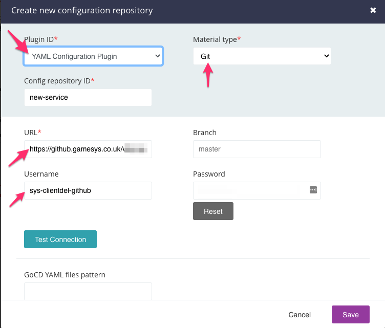
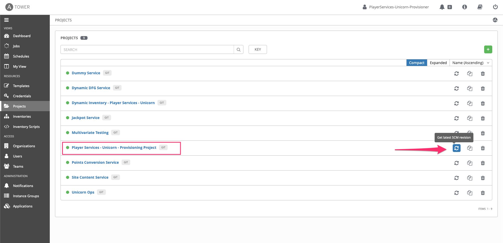
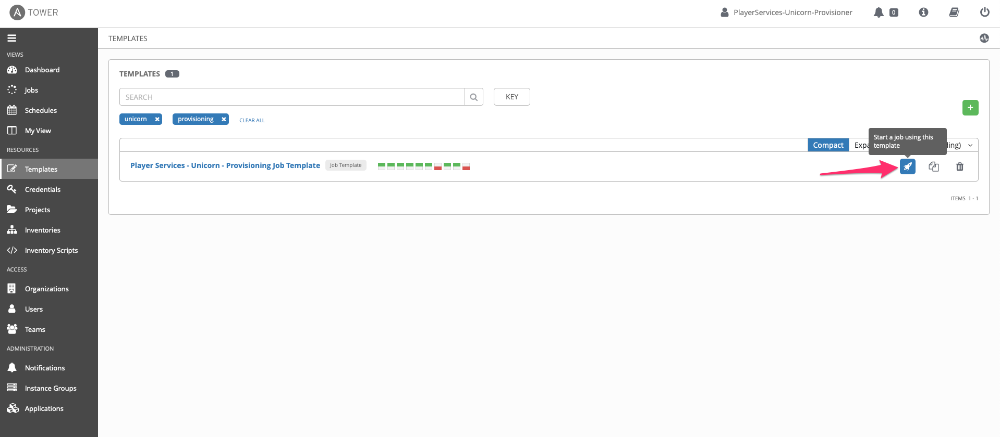
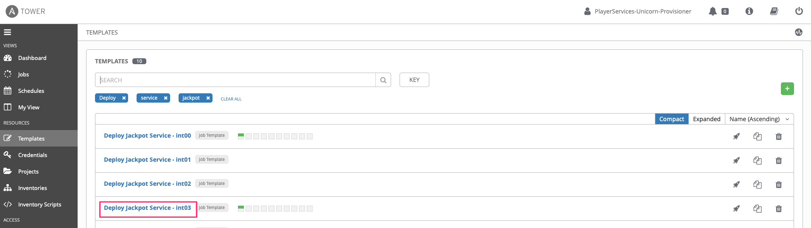
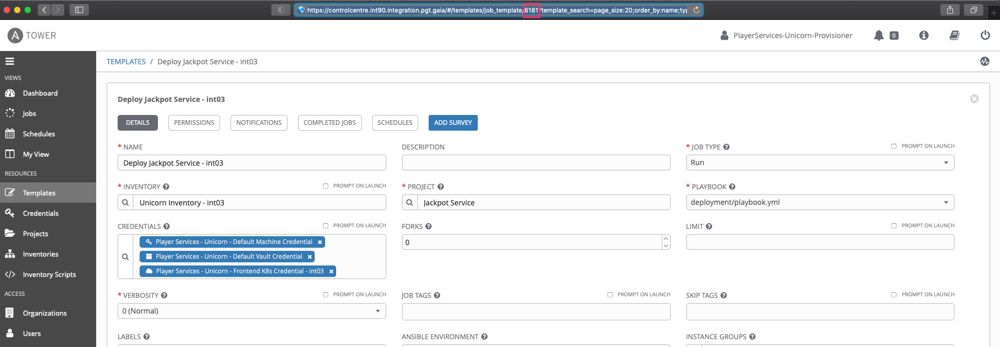
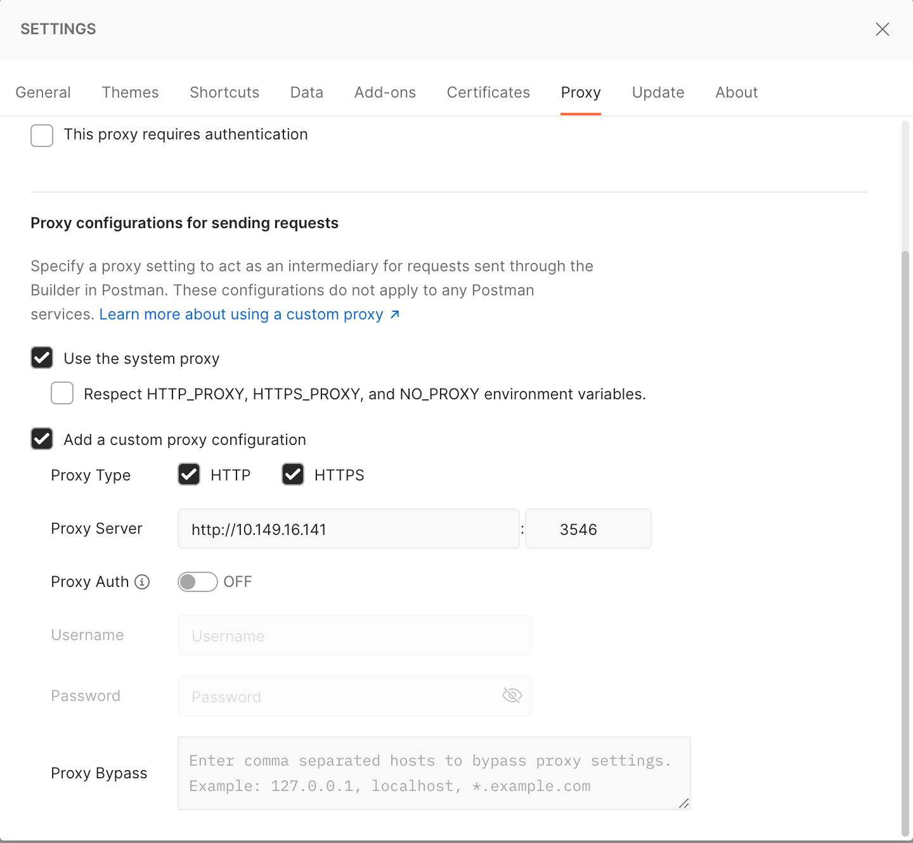

## Deploying your service
You will need to do some prerequisite steps to be able to deploy your service to the different environments:
 - [Adding pipelines in GoCD from code](#adding-pipelines-in-gocd-from-code)
 - [Creating Ansible templates](#creating-ansible-templates)
 - [Create-release-ticket pipeline prerequisite](#create-release-ticket-pipeline-prerequisite)
 - [Credentials](#finding-credentials)

All the scripts needed to do a basic deployment to INT, PP and LIVE are located in the deployment folder.

In there under `config` are located configuration `.yml` files for INT, PP and LIVE environments, the values from which get used later on in the deployment scripts.

Under `pipelines`, live the `.yaml` files describing the GoCD pipelines needed to build, deploy, scan and rollback a service.
Any parameters that need to be passed form the pipelines to the deployment scripts live under parameters in those `.yaml` files.
Those later on get passed in the environment `.yaml` files under config and used by the deployment scripts.



The ansible deployment scripts are located in the 'roles' folder and `playbok.yml`.

### Adding pipelines in GoCD from code

To add the provided pipelines to GoCD first you need to have your service already in a github repo.
After this:
  Step 1:  go to `GoCD -> admin -> Config Repositories ` and add a new configuration repository

  

  Add the pipeline as `Git` material and provide the url to your service repo. This is how GoCD will know to find the pipelines configuration from your repository.
  The branch should be the base branch you merge your code changes to - usually `master`. Plugin ID should be `YAML configuration Plugin`, since you are providing .yml pipeline config files. Lastly provide user credentials for user that has read/write access to your github repo. For unicorn at the moment of writing this is the `sys-clientdel-github` user. Note that if you provide an SSH URL (e.g. git@github.gamesys.co.uk:PlayerServices/front-end-auth-service.git) you won't have to provide a Username.

  After saving you should see your pipeline config in the list on the same page.

  

  If all necessary params are correct, you should see your pipelines created with the pipeline group name - which is the same as the name of your service.

### Creating Ansible templates

Before being able to deploy your service to any of the environments with the provided deployment scripts, you will need to create a task for creating a deployment template for your service in Ansible tower.

To do this, you need to create a separate role for your service against the [unicorn-tower-bootstrap repository](https://github.gamesys.co.uk/PlayerServices/unicorn-tower-bootstrap/tree/master/roles) with the name of your service as a folder name under the `roles` folder. This repo is an in code description of unicorn's projects in the ansible tower instance.

Please make sure to follow the current structure that the services already there have:
 - Any variables for the deployment template living under `vars/main.yml`
 - Any dependencies on other roles under `meta/main.yml` - at the moment hose are the same for all unicorn services so should be ok to copy this straight from any of them - [main.yml](https://github.gamesys.co.uk/PlayerServices/unicorn-tower-bootstrap/blob/master/roles/jps/meta/main.yml)
 - The deployment template for your service living under `tasks/main.yml`. Any modification you may need for the deployment template should be made here.

 After creating your role, you need to add it to [site.yml](https://github.gamesys.co.uk/PlayerServices/unicorn-tower-bootstrap/blob/master/site.yml) under the `roles` declaration with the folder name as role name. You will also need to pass the environment instances as variables to your role (similar to how it's been already done for the other services).

 ```yml
  ....
  roles:
    - role: unicorn_apps
      vars:
        environ_instances: "\{{ fullstack_environments|default([]) }}"
    - role: ddfg
      vars:
        environ_instances: "\{{ fullstack_environments|default([]) }}"
    - role: **{my_new_service}**
      vars:
        environ_instances: "\{{ fullstack_environments|default([]) }}"
    ....
 ```
 (Note: Backslash in code above is only present to stop Hogan parsing it)

 Create a PR against the master branch and when your changes have been merged you'll need to login to Ansible tower for the specific environment:
  - [INT](https://controlcentre.int90.integration.pgt.gaia)
  - [PP](https://controlcentre.stg.pgt.gamesysgames.com/)
  - [LIVE](https://controlcentre.prod.inx.gamesysgames.com/) - **Preferably provision your new template to LIVE only AFTER you have deployed and tested your service on the other environments and are ready to deploy it to LIVE.**

(Note: You will need Ansible credentials to login to the INT, PP and LIVE environments listed above. See note at foot of this document.)

Once you have merged to master the changes should be automatically picked up by tower. In case you want to make sure that the latest changes are picked up go to Projects and get tle latest revision for the `Player Services - Unicorn - Provisioning Project` by clicking the refresh button next to it.



After this you need to provision the new changes by running the `Player Services - Unicorn - Provisioning Template`. To do that go to templates, search for `Unicorn - Provisioning Job Template` and launch it. This should run the .yml templates in unicorn-tower-bootstrap repository and create the templates for your service.



Once the job has finished successfully you should have a separate template for your service for each integration environment.
If you have followed the naming convention of the other services in unicorn-tower-bootstrap project, you should be able to search in templates for `Deploy {your service name} service ...` and see the templates created for your service.



Click on the template for the environment you want to deploy to and obtain the template number from the browser url.



This number needs to be added to the GoCD pipeline configuration files in your service repo -> `deployment/pipelines/deploy-*.gocd.yml` under `parameters: cc_template_number:`, replacing the `{ENV}_ANSIBLE_TEMPLATE_NUMBER`, that is already there, with your template number.

```yml
....
    parameters:
      cc_template_no: 'INT03_ANSIBLE_TEMPLATE_NUMBER'
      cc_address: https://controlcentre.int90.integration.pgt.gaia
      deploy_env: int03
....
```

**Note:**
 - You will need to do that for all pipelines for the environments you wish your service to deploy to.
 - You will aso need to repeat this process for all Ansible tower instances (INT, PP, LIVE)

After you've finished push your changes to update you pipelines on GoCD.

### Create-release-ticket pipeline prerequisite
The last part that you need to do to make your pipelines being able to deploy successfully is taking care of the create release ticket stage.

This pipeline is run immediately after your service build pipeline and is responsible for creating a Release ticket containing the any new changes made to your service. This ticket is used later on in the `deploy-*.gocd` pipelines.

Unicorn uses an internal tool (unicorn-artm) to manage release tickets, but to work for you, you need to provide it the repository and name of your service.
To do that, you'll need to make a PR against the [unicorn monorepo](https://github.gamesys.co.uk/client-delivery-platform/unicorn)

In [unicorn artm](https://github.gamesys.co.uk/client-delivery-platform/unicorn/tree/dev/packages/unicorn-artm) add your service details inside `versionTracker.js`

```javascript
....
  jackpot_service: {
		repo: 'jackpot-service',
		organisationName: PLAYER_SERVICES
  },
  my_new_service: {
		repo: 'my_new_service',
		organisationName: PLAYER_SERVICES
  },
  ....
```

The next thing you need to do is add your service to the [LIVE (live-eu or live-nj) version-tracker dashboard](https://versions.pgt01.gamesysgames.com/#/) (which is queried by unicorn-artm so it can get the changes between the live version and the version you want to release).
At the moment of writing services are only deployed to live-eu, so replace the `{{ service_name }}` with your service name in the curl below and run it. The initial app version is '0.0.0'

```bash
  curl --request PUT --data "0.0.0" http://10.149.16.95:30085/v1/kv/versions/coreplatform/live-eu/"{{ service_name }}"
```
If successful your service should appear under the LIVE-EU tab with `0.0.0` version.

After making those changes you should be able to go from build to deploy successfully.

### Testing the deployments

Deployments to the INT environments should be accessible from your local network environment.

PP and Live environments are hidden behind NGINX. To access them you will need to use a proxy (e.g. http://10.149.16.141:3546). An example of the proxy applied in the [Postman](https://www.postman.com/) API client can be seen below:



### Finding Credentials
 ¯_╏ ՞ ︿ ՞ ╏_/¯

If you need credentials for GoCD or the ansible environments you can get those from the **Rhino team &#129423; &nbsp;** or Unicorn's team leads and TLs.

