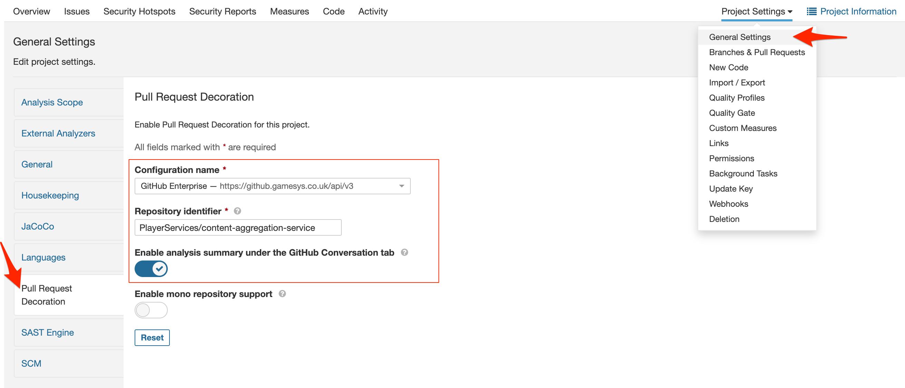
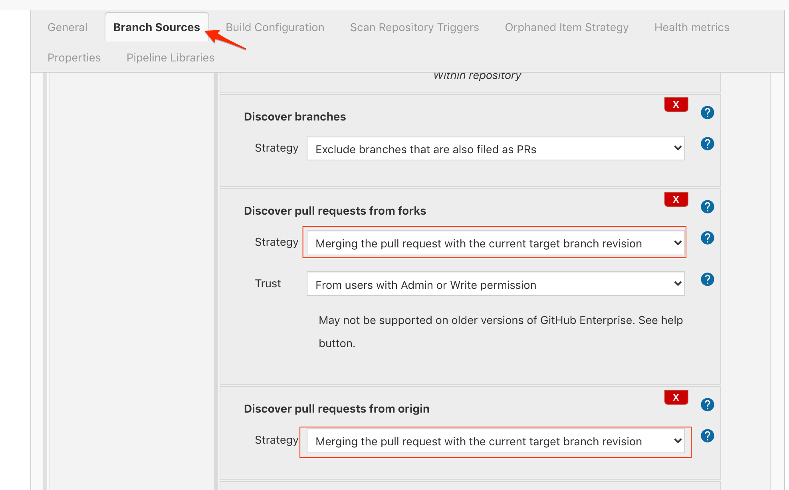
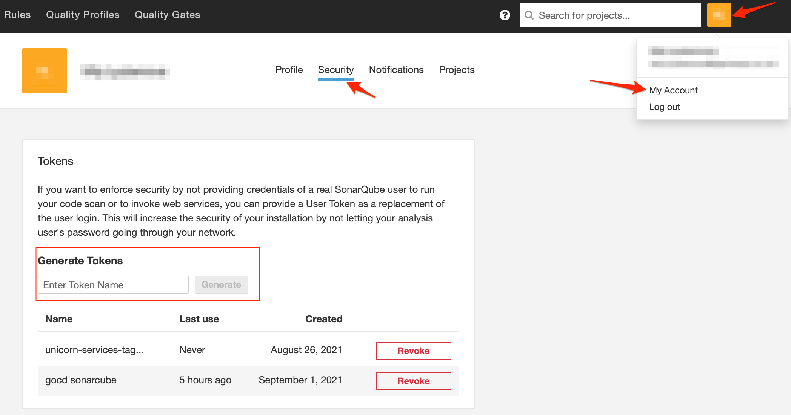

## Sonarcube scans

Sonarcube scans are run on Jenkins on every PR. Additionaly there is a scan ran on the master branch on GoCD pipeline after every PR merge to master.

### Setting up sonarcube project.
Most of the setup comes out of the box.

#### PR scan
The Jenkins scan step can be found in the Jenkinfile coming with the service.
the dockerfile used to run the scan on has node 18 and jdk 11. If another version of node is needed, that image can be changed.
However please make sure that the image you choose is either available in artifactory or is pulled via the artifactory docker proxy `dockerhub-proxy.artifactory.gamesys.co.uk/` so you don't hit the rate limit when pulling from dockerhub.

The currently available unicorn images can be found [in the unicorn-docker-images repo](https://github.gamesys.co.uk/PlayerServices/unicorn-docker-images)

```
pipeline {
    agent {
        docker {
            image 'unicorn-docker.artifactory.gamesys.co.uk/centos-openjdk11-node14'
            registryUrl 'http://unicorn-docker.artifactory.gamesys.co.uk'
            registryCredentialsId 'ARTIFACTORY_LOGIN'
            args '-p 3030-3999:3030'
            args '-u 0'
        }
    }
    stages {
        ...
        stage('Run Unit Tests') {
            steps {
                sh 'yarn test -- --ci'
            }
        }
        ...
        stage('run scans') {
            parallel {
                stage('SonarQube Scanner') {
                    environment {
                        scannerHome = tool 'Unicorn SonarQube Scanner';
                    }
                    steps {
                        withSonarQubeEnv('SonarQube PlayerServices') {
                            sh '${scannerHome}/bin/sonar-scanner'
                        }
                    }
                }
            }
        }
    }
}
```

#### Pipeline scan
The scan configuration on the pipeline lives in `deployment/pipelines/sonarcube-scan.gocd.yml`

If you need to change the sonarcube login token for GoCd or you don't have one provided, you need to encrypt yours before using it as secure variable.
You can do that by running the curl below ( taken from [GoCd docs](https://api.gocd.org/current/#encryption) ):

**For unicorn only - the user and pass for the curl below**
`-u 'sparkly.unicorn:+K9Ol5ruyZM='`

```
    curl 'https://gocd.psunicorncd.pgt.gaia/go/api/admin/encrypt' \
    -u 'username:password' \
    -H 'Accept: application/vnd.go.cd.v1+json' \
    -H 'Content-Type: application/json' \
    -X POST -d '
    "value": "{your_sonarcube_api_token}"
    }'
```

After running an initial scan Sonarcube should be able to pickup your project and the main branch automatically.
Following that you should be able to see you project on the sonarcube dashboard - https://sonarqube.gamesysgames.com/dashboard

### Additional configuration
After finding your project in the dashboard a couple of things need to be setup manually so Sonarcube can correctly see the repository and the branches.

**You will need admin rights to set this up or you will need to use a general admin sonarcube user set up for your team/organization!**

#### Setting tags on your project
Tagging your projects helps organizing them under a specific category and makes filtering for projects under a common category easier.
You can use the sonarcube API to add tags to your project. Keep in mind only accounts with admin permissions can be used to set tags.
The POST requests takes in `project` and `tags` parameters. The `project` param is your project identifier that can be seen in sonarcube, and tags takes comma separated values. Note that any tags passed override any tags that might already be set. In the case of setting up a new project there won't be any project tags set up initially.
To authenticate you need to pass a user token (this is the recommended way of authentication), [you can see here how to set up a token if none is provided to you or your organization](#obtaining-authentication-token). Note that you need the the `:` after the token as this would indicate an empty password.
Execute the curl below to add tags to your project.

**Any unicorn services should be tagged with `excite-unicorn`**

```
    curl -u "{admin_user_token}":
    -d "project={{generated_service_id}}&tags=excite-unicorn"
    -X POST "https://sonarqube.gamesysgames.com/api/project_tags/set"
```

#### Configuring pull request decoration
Navigate to `Project Settings` -> `General Settings`. Once there choose `Pull Request Decoration` from the side menu and set the `Configuration Name` to Github Enterprise and `Project Identifier` to the github url for your service. If you want Sonarcube to be able to leave a comment under the pr toggle on the "Enable analysis summary under the GitHub Conversation tab" toggle.




#### Making sure you make a full clone of your project in jenkins (for PR scans only and having complete PR decoration)
In order for Sonarcube to be able to make coverage and duplication evaluations on your PRs you need to make a full clone of the repository where you are running the PR scans.

For PR checks run on jenkins this can be checked in the [settings of your project](https://jenkins.psunicorn.pgt.gaia/job/games-master-service/configure).

Under Branch Sources those are the options selected.


#### Obtaining authentication token

**You will only need this if there is no user for your team or area. Please check before using a personal token for any automation**

In order to get a token for authentication when using sonarcube API select your profile icon -> My Account -> Security. Under the security tab you can generate api tokens. You can have multiple tokens.



### Contributing to the quality gates and end where we want to go

Eventually the quality gate that should be used trough Excite should be [Excite way](https://sonarqube.gamesysgames.com/profiles/show?language=js&name=Excite+way).
However this is the end goal, and while striving to get there the quality gates can be setup per project, after deciding reasonable tresholds with your area and Tech leads.

Contributions to the Exite quality gate can also be made [against the Gamesys-Architecture/sonarqube-configuration repo](https://github.gamesys.co.uk/Gamesys-Architecture/sonarqube-configuration).
